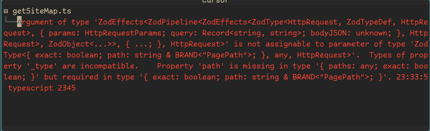
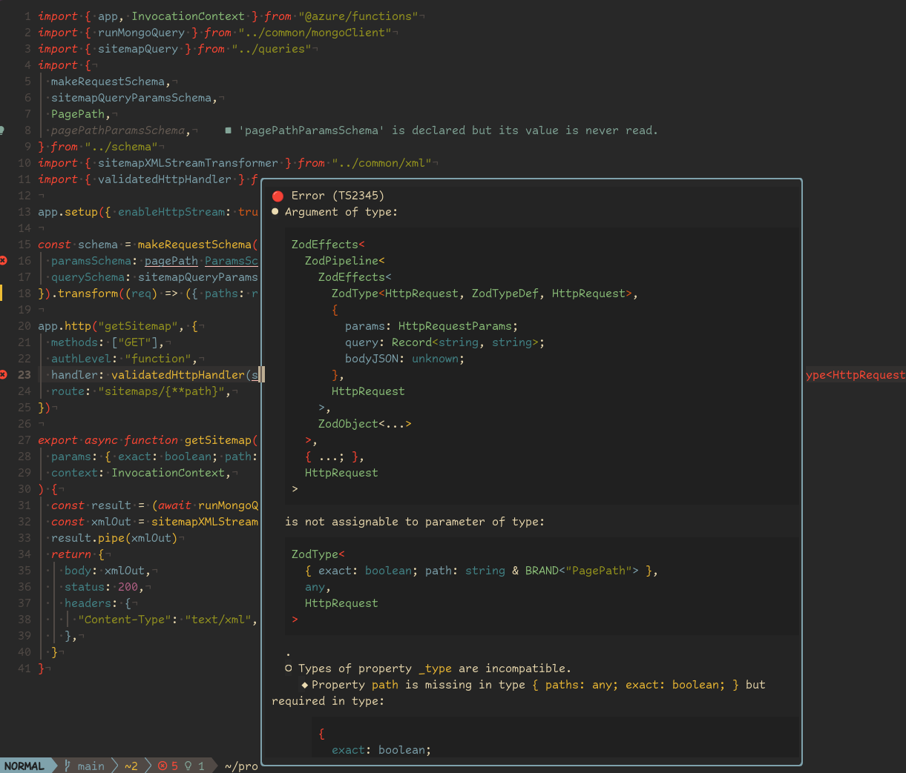

# TSErrors

Displays nicely formatted Typescript errors in a popup window.

## Introduction

This is a simple plugin that does one thing.
It shows diagnostics produced by the Typescript LSP in a popup window, in a way which
should be much more legible than the default experience.

Instead of this:


You get something more like this:



This plugin is work in progress. It's working for me, but there may well be some rough edges.

## Requirements

You will need to have the following installed:

- hexh250786313/pretty-ts-errors-markdown npm package
- MeanderingProgrammer/render-markdown.nvim plugin

## Features

- Provides a command that will open a popup that shows the diagnostic currently under the cursor
- Text of the diagnostic is rendered in a readable way
- Complex typescript types are rendered in code blocks with nice syntax highlighting provided by treesitter.

## Installation

1. Install pretty-ts-errors-markdown globally:

```sh
npm install -g pretty-ts-errors-markdown
```

2. Install this plugin

Be sure that render-markdown.nvim is also loaded before the setup function of this plugin is called.
For example, if you are using Lazy.nvim as your plugin manager, do this:

```lua
{
  "davidfriar/tserrors.nvim",
  dependencies = {
    "MeanderingProgrammer/render-markdown.nvim",
  },
  --- @class (exact) tserrors.UserOptions
  opts = {}
}
```

Note that TSErrors requires that the setup function is called or it will not work (Lazy.nvim does this
automatically if you provide 'opts', which can be empty)

## Configuration

You may not need to do any configuration.

If you want to change the size of the popup then max_height and max_width will do that.

Most of the other configs just expose options that are passed directly to the Neovim APIs, so if you want to hack around you may
be able to things like making the window open as a split rather than a popup then that may turn out to be possible.

The default configuration is like this:

```lua
---@type  tserrors.Options
M.defaults = {
  file_type = "tserror",
  markdown_overrides = {
    code = {
      style = "normal",
      highlight = "RenderMarkDownErrorsCode",
      left_pad = 1,
      right_pad = 1,
    },
  },
  win_open_opts = {
    focusable = false,
    relative = "cursor",
    style = "minimal",
    row = 1,
    col = 0,
    border = "rounded",
  },
  window_options = {
    wrap = true,
    linebreak = true,
  },
  buffer_options = {
    readonly = true,
    modifiable = false,
  },
  max_width = 160,
  max_height = 50,
  padding = 1,
}
```

## Commands

TSErrors exposes a single vim command `:TSErrors` which has the following subcommands:

- `show_diagnostic` Opens the TSErrors popup window, displaying the diagnostic under the cursor
- `close` Closes the TSErrors popup window
- `toggle` Opens the TSEErrors poopup window and displays the diagnostic under the cursor if it is not already open and closes it otherwise.
- `scroll_down` Scrolls the diagnostic in the popup half a screen downwards
- `scroll_up` Scrolls the diagnostic in the popup half a screen upwards
- `focus` Moves focus into the popup window. Normally the popup window is not focusable (e.g. with a mouse or ctrl w navigation). This command might be useful if you want to copy the diagnostic text, for example.

## API

The commands above are also available as Lua function calls in the `tserrors` module:

```lua
require("tserrors").show_diagnostic_for_cursor()

require("tserrors").toggle()

require("tserrors").scroll_down()

require("tserrors").scroll_up()

require("tserrors").close()

require("tserrors").focus()
```

## Mappings

TSErrors does not create any keymaps out of the box, to avoid creating any conflicts. You will most likely want to create some mappings of your own.

Here is what I have, in my (lazy.nvim) configuration:

```lua
{
  "davidfriar/tserrors.nvim",
  dependencies = {
    "MeanderingProgrammer/render-markdown.nvim",
  },
  --- @class (exact) tserrors.UserOptions
  opts = {
  },
  keys = {
    {
      "<leader>lr",
      "<cmd>Lazy reload pretty-tserrors-md.nvim<cr>",
      desc = "Reload pretty-tserrors-md.nvim",
      mode = { "n" },
    },

    {
      "<leader>ee",
      "<cmd>TSErrors toggle<cr>",
      desc = "Show or hide TSErrors",
      mode = { "n" },
    },
    {
      "<leader>ed",
      "<cmd>TSErrors scroll_down<cr>",
      desc = "Scroll TSErrors down",
      mode = { "n" },
    },
    {
      "<leader>eu",
      "<cmd>TSErrors scroll_up<cr>",
      desc = "Scroll TSErrors down",
      mode = { "n" },
    },
    {
      "<leader>ef",
      "<cmd>TSErrors focus<cr>",
      desc = "Move focus to the TSErrors window",
      mode = { "n" },
    },
  },
}

```

## Credits

This plugin sits on the shoulders of giants, who did all the real work. TSErrors just provides a bit of plumbing to make the parts fit together.

- The original Pretty Typescript Errors for VSCode is the work of **yoavblis**, who made this possible (https://github.com/yoavbls/pretty-ts-errors)
- Making this available as markdown so that we can use it in Neovim is the work of **hexh250786313** (https://github.com/hexh250786313/pretty-ts-errors-markdown)
- Rendering the markdown so it all looks pretty is done with the excellent _render-markdown.nvim_ from **MeanderingProgrammer** (https://github.com/MeanderingProgrammer/render-markdown.nvim)
